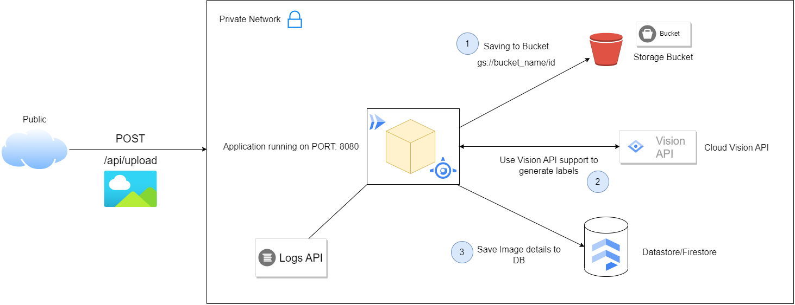

### What's this?
Photo-2-Bucket is a Google Cloud platform powered service that makes uploading and retrieving photos for your apps a hassle-free approach. It comes with Google Cloud platform AI powered technology **Cloud Vision API** to perform Machine Learning based Image scanning for quick Object Detection and Fetching Image attributes to meet your any kind of Business purpose. Try it now!

#### Features:
The application is packed with following features:

* **Storage Bucket**
GCP Storage Bucket is a Google Cloud service that lets your dispose your Objects or **BLOBs** (Binary Large Storage Objects) such as Documents/CSVs/Images/etc. for any kinds of needs. The application uses GCP Storage Bucket technology to save your photos in Bucket specified by `UUID` generated filename.

* **Cloud Vision API**
Cloud Vision API is Google Cloud's AI service powered by Machine Learning backed computations to perform different types of Machine Learning and Object Detections approaches to your applications. The application supports Vision API integration to perform a quick scan over your image and get some image attributes based on accuracy.

* **Datastore/Firestore**
This is a Google Cloud powered NoSQL Database for storing your documents under collections. The application uses Datastore to dump your Image details based on `id`, `uri` and `attributes` to Database for storing as records.

#### How it works?
The application uses RESTful architecture to upload or retrieve Photo from Cloud.
* **Uploading a Photo:** Make a _POST_ request to `HOST:8080/api/upload` with Image/Photo as _File_ attached with _Content-Type: multipart/form; boundary=WebAppBoundary_ and _Content-Disposition_ (check out _RESTClient.http_ to understand more about the request type). It will upload or save your Photo to Storage Bucket.
* **Retrieving a Photo:** Make a _GET_ request to `HOST:8080/api/image/{id}` to retrieve a specific photo from Storage Bucket. The `id` passed in URI request parameter is the id of the photo you want to retrieve from Storage Bucket. The response returned is the Photo (retrieved by id) with a status code of 200 OK.

#### Workflow:

